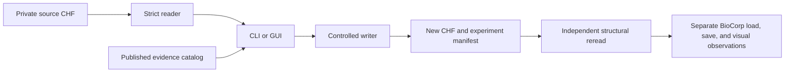

# Architecture

CHF Editor runs locally. Its supported workflow has four layers:

| Layer | Files | Responsibility |
| --- | --- | --- |
| Strict reader | `chflab/inspector.py` | Validate the 4,096-byte container, CRC32C, Zstandard payload, v7/v8 grammar, and expose a structural diff. It assigns no visual meaning. |
| Evidence catalog | `chflab/evidence.py` and the JSON catalogs | Match published observations to a bounded structural context. Names and matching signatures remain clues, not universal mappings. |
| Controlled writer | `chf.py` | Change balanced DNA weights or one existing material value; preserve the source, validate the exact logical diff, and publish a new CHF plus manifest. |
| Desktop interface | `gui.py` | Select local inputs, display inspected data and evidence, and call the same writer used by the CLI. |

The CLI is both a user entry point and the current writer module. Keeping the GUI on that writer avoids two independent export rules. Research references and private experiments do not enter the runtime path. `outputs/` is ignored by Git and holds local presets, manifests, and captures.

The optional [save monitor](SAVE_MONITOR.md) observes stable local CHF saves,
archives before/after files and candidate diffs, and can retain a bounded local
game-window capture sequence. It does not write the watched preset, infer UI
gestures, automate game input or promote evidence automatically. Pillow is an
optional capture dependency; file monitoring uses the standard library.

The current [validation snapshot](VALIDATION_STATUS.md) records 14 material
selectors and five DNA observations, including six historical owner-accepted
material effects. Additional observations retain their own reference/build
scope; a matching selector does not validate the file being inspected.

## Export contract

The writer rejects invalid sources, changed GUI sources, unsupported values, and pre-existing output or manifest paths. It changes only the selected payload fields, tries bounded Zstandard compression levels, preserves protected container bytes, recalculates CRC32C, checks the expected logical diff, and re-reads the published file. If publication fails, it removes only files created by that attempt. It never overwrites an existing preset or manifest.

Structural validity is the only automated verdict. Game loading, game saving, and appearance require observations in the target build. A named hash or a successful parse cannot supply those verdicts.

## Boundaries for future work

Keep new parsing rules in the reader and new evidence in the catalog with source and scope. Add a writer operation only after its byte-level preservation and expected diff can be specified. A general recipe engine or complete character creator belongs after controlled game validation of the relevant fields and explicit approval of that phase.
